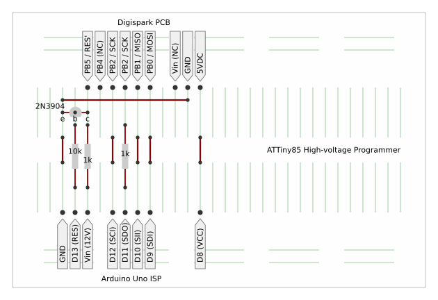
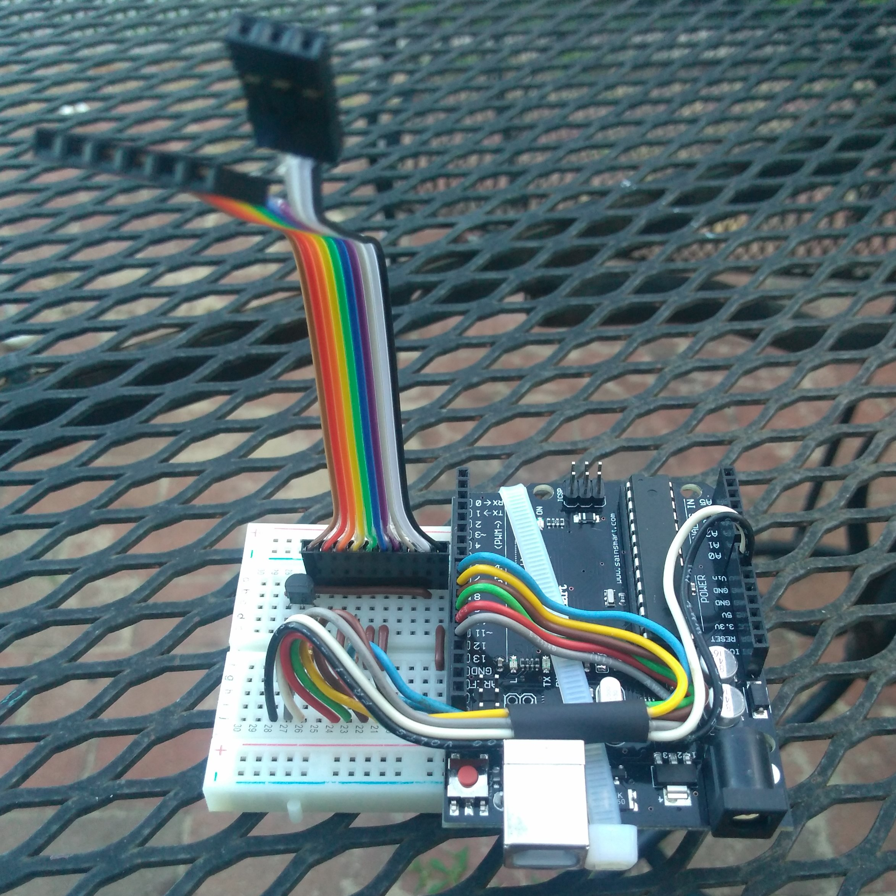

# digispark-hvp
__Digispark High-Voltage Programmer__

Program the Digispark's ATtiny85 with an Arduino UNO.
<!-- keywords: arduino uno digispark attiny85 high-voltage programmer -->

## Overview

Here's a completely rewritten "Arduino as ISP" sketch that can program the
ATtiny85, in situ, on the Digispark board via its 6- and 3- pin connectors.
It uses an Arduino Uno R3 as the programmer, and implements the ATtiny85's
high-voltage serial programming protocol. As such, it can program devices
that have disabled (re-assigned) the RESET pin (e.g. the Digispark board).

This programmer includes a command to interactively erase the ATtiny85
and program its fuses and lock bits. The command is not very sophisticated,
but it works fairly well with the Arduino IDE's serial monitor. Entering
'Z' in the monitor initiates this interactive programming mode.

Since this program more or less emulates a STK500_v1 serial programmer,
it can be used with the "AVR ISP" programmer as well as the "Arduino
as ISP" programmer. Seems the main difference is that avrdude configures
different default baud rates for the programmers (19200 for "Arduino as
ISP" and 115200 for "AVR ISP").

## Programmer Pin Assignments

The "schematic" below shows the circuit and connections between the Uno R3
and the Digispark's two headers. Three resistors and one NPN transistor are
the only additional components. A 12vdc (12.5vdc) AC power adapter supplies
power to the Uno and provides the 12v "high voltage" needed to drive the
reset pin of the ATtiny85 on the Digispark board. Note: this circuit is
designed specifically to interface to the Digispark. Though it's customary
to place resistors in series for the connections between the programmer
(Uno R3) and the target device (Digispark), existing circuitry on pins PB1
and PB3 of the Digispark may interfere with such a practice.

~~~
 UnoR3                      Digispark
 
 D8  ---------------------- Vcc ( -> VCC, 5vdc)
 
 D9  ---------------------- PB0 ( -> SDI)
 
 D10 ---------------------- PB1 ( -> SII)
      1.0K ohm
 D11 --/\/\/--------------- PB2 (<-> SDO)
 
 D12 ---------------------- PB3 ( -> SCL)
      1.0K ohm
 VIN --/\/\/-----------/--- PB5 ( -> RST, 12vdc)
      4.7K ohm       c/
 D13 --/\/\/----b(-|<) 2N3904
                     e\
 GND ------------------\--- GND
~~~

## Realization

I cobbled together the programmer with an Uno R3, a breadboard, and parts I
happen to have on hand. I put a little extra effort into creating a ribbon
cable and connectors so I can easily attach the Digispark to the programmer.
The pics below show an image of the breadboard layout and a photo of the
completed programmer. The digispark_hvp is used directly with the Arduino IDE
to program the Digispark and set its fuses. Under the "Tools" menu, "Board"
is set to ATTinyCore's "ATtiny25/45/85 (No bootloader)" and "Programmer"
is set to "AVR ISP". A 12vdc power adapter connected to the Uno's barrel jack
supplies power to the Uno, the Digispark, and provides the 12vdc "high-voltage"
necessary to program the Digispark's ATtiny85.

  
*A prototyping layout for digispark-hvp*

  
*My rendition of the digispark-hvp*

## License

digispark-hvp, copyright © 2025 by Aegean Associates Inc., is licensed under
Creative Commons Attribution-NonCommercial-ShareAlike 4.0 International. To
view a copy of this license, visit
https://creativecommons.org/licenses/by-nc-sa/4.0/ 
